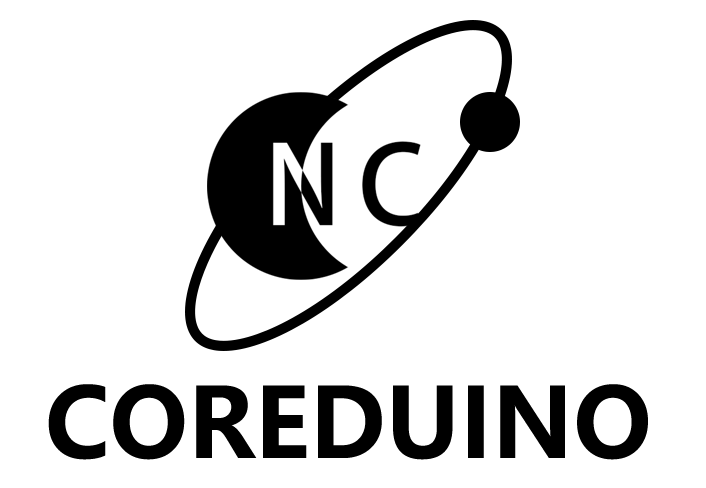

<h1 align="center">EDA-Project</h1>

Welcome to NekokeCore’s EDA Project OpenSource Repository

## Why I created this repository？

Recently got hooked on electronic design, in order to better learn and improve so created this repository, I hope you point out my mistakes, which will help me a lot.

## What's in here?

| Project Name                                                                                  | Project ID | Date      | Status                     |
| --------------------------------------------------------------------------------------------- | ---------- | --------- | -------------------------- |
| A gift for some friends  | 2022042810 | 2022.4.28 | Merged                     |
| Keyboard Project | 2022060110 | 2022.6.01 | Finished，Debugging         |
| Testboard Project | 2022060180 | 2022.6.18 | Finished Step A3，A2 Producing， Waiting for checking|
| USBDisk Project | 2022060200 | 2022.6.20 | In Progress                |
| Coredunio Project | 2022060230 | 2022.6.23 | In Progress                |
| Vibrator Project | 2022060201 | 2022.6.20 | In Progress                |
| Network Switch Project | 202206290 | 2022.6.29 | Working               |

## Credit

Not yet.